<div align="center">

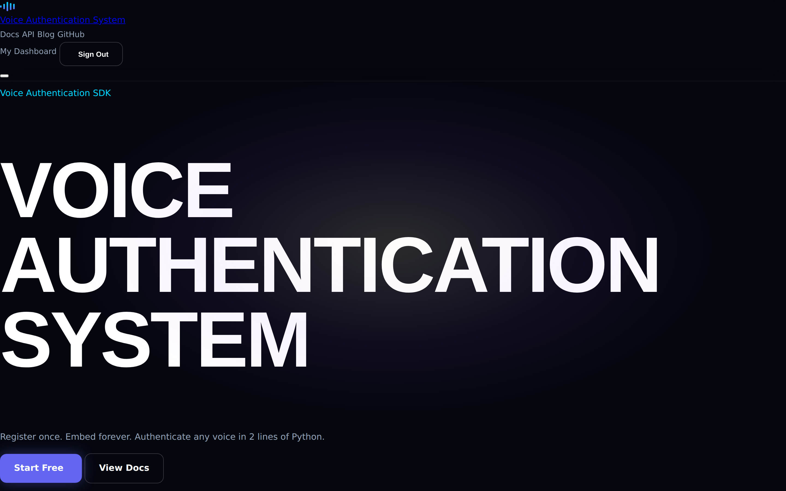

# 🎙️ Voice Authentication System

### Your Voice. Your Identity. Zero Compromise.

**Register once. Embed forever. Authenticate any voice in 2 lines of Python.**

A local-first voice-authentication platform that turns a handful of voice samples into a
personalised, installable Python SDK (`.whl`) — powered by a SpeechBrain **ECAPA-TDNN**
speaker-embedding model. No audio ever leaves your infrastructure.

<br/>

<!-- Project badges -->
[](LICENSE)
[](https://github.com/asadullahirshad3/Voice-Authentication-System/actions)


<!-- Tech badges -->


<br/>

### 🎬 Live walkthrough

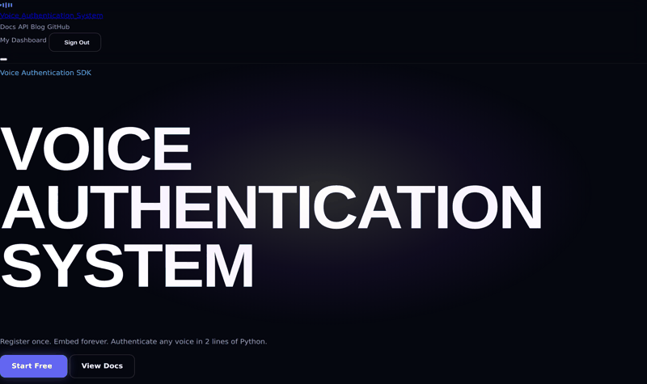

</div>

---

## 📖 Table of contents

- [Overview](#-overview)
- [Screenshots](#-screenshots)
- [Key features](#-key-features)
- [Architecture](#-architecture)
- [How it works](#-how-it-works)
- [The pipeline](#-the-pipeline)
- [Tech stack & skills](#-tech-stack--skills)
- [Project stats](#-project-stats)
- [What's new in v2](#-whats-new-in-v2)
- [Quickstart](#-quickstart)
- [Configuration keys](#-configuration-keys)
- [API reference](#-api-reference)
- [Using your generated SDK](#-using-your-generated-sdk)
- [Data model](#-data-model)
- [Project structure](#-project-structure)
- [Testing & quality](#-testing--quality)
- [Security](#-security)
- [Roadmap](#-roadmap)
- [Keywords](#-keywords)
- [License & author](#-license--author)

---

## 🎯 Overview

Voice Authentication System verifies **who is speaking** by comparing a live voice sample
against an enrolled voiceprint — entirely on your own machine or server.

1. A user records or uploads 5–20 short voice clips.
2. The backend cleans each clip, extracts a **192-dimensional embedding**, and averages
   them into one master voiceprint.
3. That voiceprint is *baked into* a generated Python package and compiled into a `.whl`.
4. Anyone can then authenticate a voice in two lines of Python — offline.

| Mode | Endpoint | Produces | Use case |
|------|----------|----------|----------|
| **Individual** | `POST /api/process` | `authenticate(audio) → bool` | 1:1 login / identity check |
| **Company / Team** | `POST /api/process_company` | `identify(audio) → "Name"` | 1:N speaker classification |

---

## 📸 Screenshots

<table>
  <tr>
    <td width="50%"><br/><sub><b>Landing</b> — WebGL audio-wave hero</sub></td>
    <td width="50%">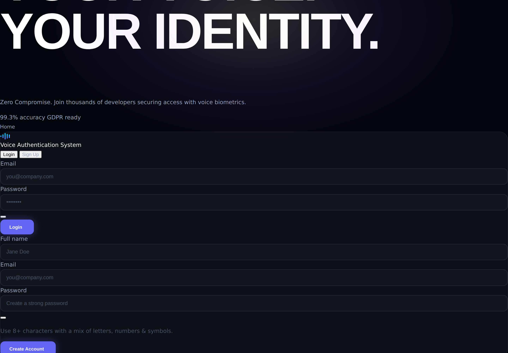<br/><sub><b>Auth</b> — split-panel login / sign-up</sub></td>
  </tr>
  <tr>
    <td width="50%">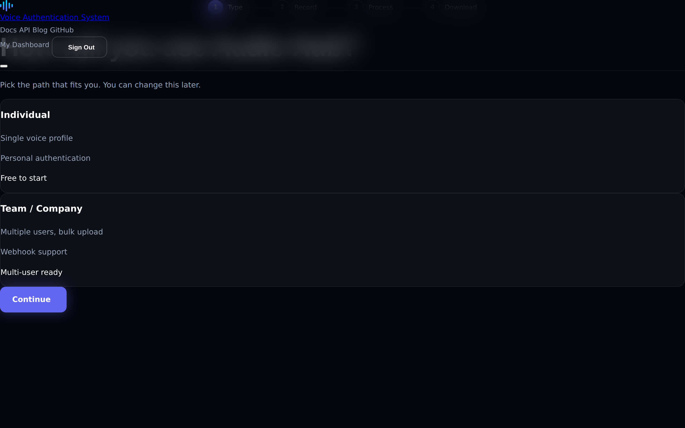<br/><sub><b>Account type</b> — Individual vs Team / Company</sub></td>
    <td width="50%">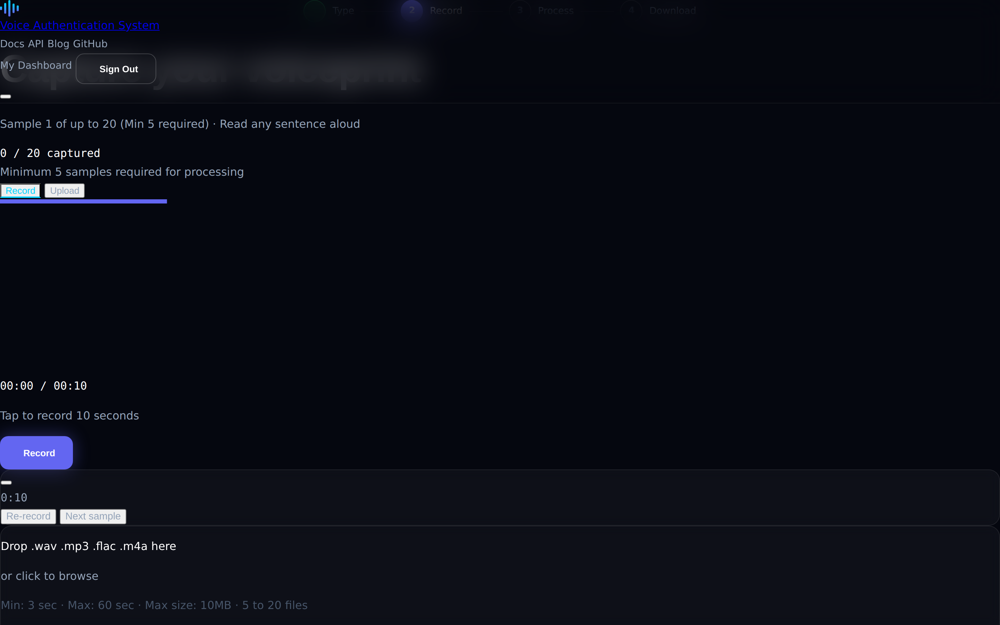<br/><sub><b>Recording</b> — record or upload voice samples</sub></td>
  </tr>
  <tr>
    <td width="50%">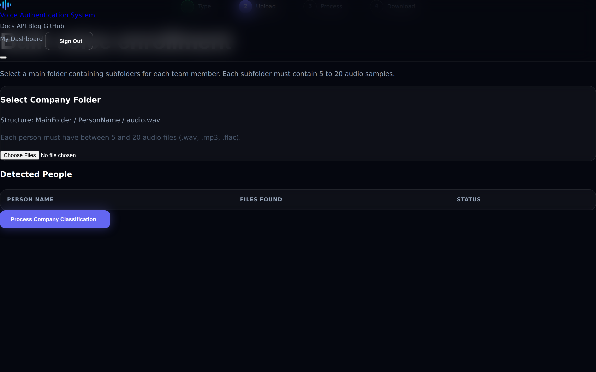<br/><sub><b>Company upload</b> — bulk team enrollment</sub></td>
    <td width="50%">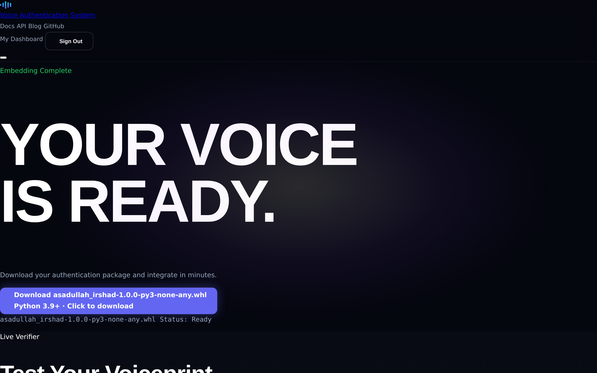<br/><sub><b>Download</b> — grab your generated <code>.whl</code></sub></td>
  </tr>
  <tr>
    <td width="50%">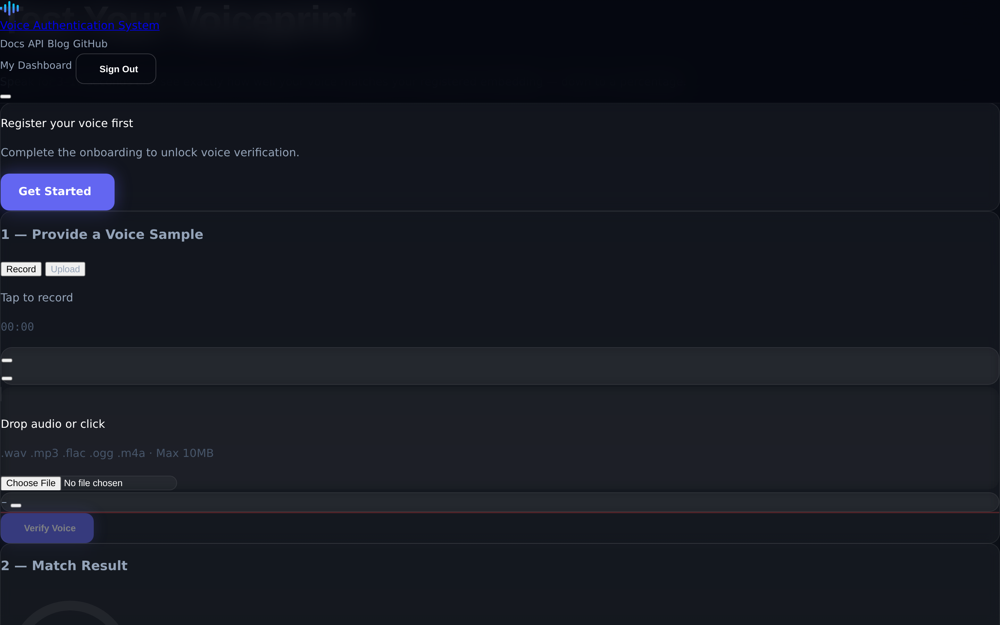<br/><sub><b>Live verifier</b> — test a voice sample in the browser</sub></td>
    <td width="50%"><br/><sub><b>Ready state</b> — "Your voice is ready"</sub></td>
  </tr>
  <tr>
    <td colspan="2">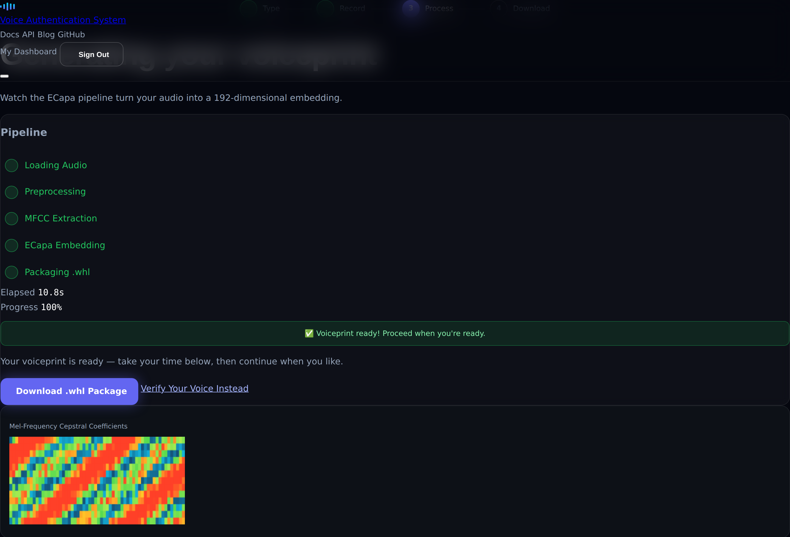<br/><sub><b>Processing</b> — live pipeline panel with the MFCC heatmap and 192-dim embedding rendered in the browser</sub></td>
  </tr>
</table>

---

## ✨ Key features

- 🔒 **Local-first & private** — audio never leaves your infrastructure; embeddings and wheels stay on disk.
- 🧠 **State-of-the-art embeddings** — SpeechBrain ECAPA-TDNN (VoxCeleb) 192-dim speaker vectors.
- 📦 **Generates a real SDK** — outputs an installable `audioauth` `.whl` with the voiceprint baked in.
- 👥 **Two modes** — individual 1:1 authentication and company-wide 1:N speaker identification.
- 🛡️ **Hardened security** — bcrypt password hashing, JWT bearer auth, CORS allow-list, rate limiting.
- 🎨 **Premium frontend** — WebGL shader hero, live MFCC/embedding visualizations, in-browser recorder.
- 🐳 **Production-ready** — Dockerfile, docker-compose, GitHub Actions CI, pytest suite, ruff linting.

<details>
<summary><b>Full page-by-page feature tour</b> (click to expand)</summary>

| Page | File | Highlights |
|------|------|-----------|
| **Landing** | `index.html` | WebGL hero shader + bloom, How-It-Works flow, "2 lines of auth" code showcase, bento feature grid, pricing, social-proof marquee |
| **Auth** | `auth.html` | Split glass layout, Login ⇄ Sign-Up tabs, password show/hide, 4-segment strength meter |
| **Account Type** | `onboarding-type.html` | 4-step stepper, Individual vs Team cards with animated selection |
| **Voice Recording** | `onboarding-record.html` | Web Audio API + MediaRecorder, 240px mic circle with live level, 10s countdown, drag-and-drop upload |
| **Company Upload** | `onboarding-company.html` | Spreadsheet-style bulk table, CSV import modal, per-person status badges |
| **Processing** | `onboarding-processing.html` | Live pipeline panel + MFCC heatmap, waveform/energy, pitch contour, 192-dim embedding bars, UMAP scatter |
| **Download** | `download.html` | Ready-state hero, authenticated `.whl` download, live in-browser voice verification demo |

</details>

---

## 🏗️ Architecture

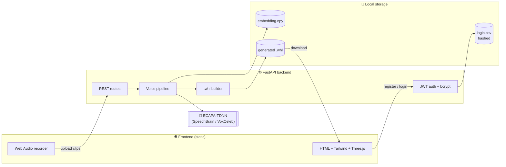

---

## 🔄 How it works

**Enrollment → SDK generation**

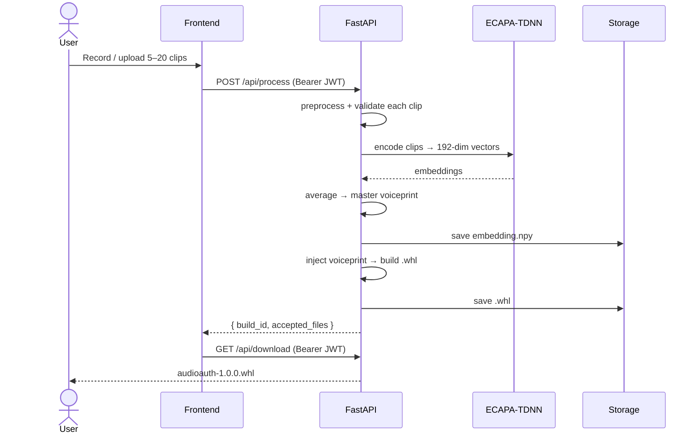

**Verification**

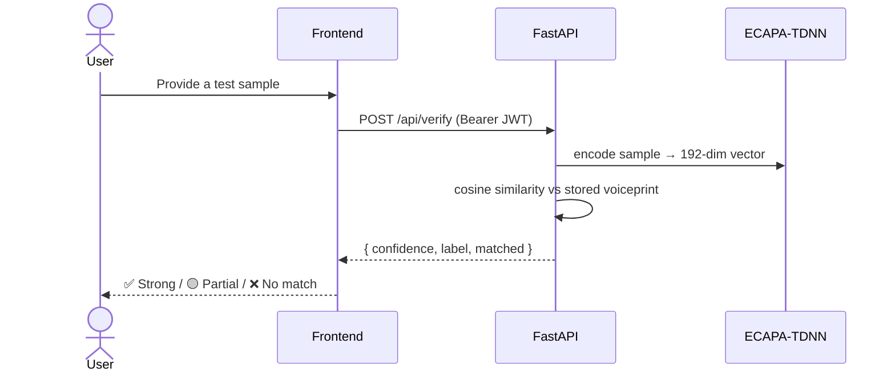

---

## 🔬 The pipeline

| # | Stage | Module | Input → Output |
|---|-------|--------|----------------|
| 1 | **Preprocess** | `pipeline/preprocess.py` | audio file → 16 kHz mono float32, trimmed/padded to 3 s, peak-normalised (rejects clips < 2 s) |
| 2 | **Embed** | `pipeline/embedding.py` | audio array → 192-dim ECAPA-TDNN vector |
| 3 | **Average** | `pipeline/averaging.py` | N embeddings → 1 master voiceprint (mean) |
| 4 | **Inject** | `pipeline/injector.py` | master vector → baked into `core.py` template |
| 5 | **Build** | `pipeline/builder.py` | package folder → installable `.whl` |

**Match thresholds** (cosine similarity, used in the generated SDK):

| Cosine score | Verdict |
|-------------|---------|
| ≥ 0.75 | ✅ Strong match |
| 0.60 – 0.75 | 🟡 Partial match |
| < 0.60 | ❌ Rejected |

---

## 🧰 Tech stack & skills

<div align="center">

**Backend & API**


**Machine Learning & Audio**


**Frontend**


**Security & Auth**


**DevOps & Tooling**


</div>

| Layer | Technology | Purpose |
|-------|-----------|---------|
| API | FastAPI, Uvicorn | Async REST API + ASGI server |
| Auth | PyJWT, passlib + bcrypt | Bearer tokens, password hashing |
| ML / audio | SpeechBrain (ECAPA-TDNN), PyTorch, torchaudio, librosa, soundfile | Speaker embeddings + audio decoding |
| Config | pydantic-settings | Type-safe, env-driven config |
| Packaging | PyPA `build` | Compiles the per-user SDK `.whl` |
| Frontend | HTML, Tailwind (CDN), Three.js, ECharts, Web Audio API | Animated UI, live visualizations, recording |
| Dev / CI | pytest, ruff, Docker, GitHub Actions | Tests, linting, containers, automation |

---

## 📊 Project stats

| Metric | Value |
|--------|------:|
| Total files | 58 |
| Lines of code (py + js + html + css) | ~5,700 |
| Python | 1,724 lines · 24 files |
| JavaScript | 999 lines · 5 files |
| HTML | 2,653 lines · 8 files |
| CSS | 353 lines |
| REST API endpoints | 8 |
| Pipeline stages | 5 |
| Frontend pages | 7 |
| Automated tests | 17 ✅ |
| Embedding dimensionality | 192 |
| Model | ECAPA-TDNN (VoxCeleb) |

---

## 🆕 What's new in v2

This release hardens the original prototype into a production-ready project.

| Area | v1 (prototype) | v2 (this release) |
|------|----------------|-------------------|
| Passwords | ❌ stored in plaintext | ✅ bcrypt-hashed (work factor 12) |
| Authentication | ❌ email in request body | ✅ JWT bearer tokens |
| CORS | ⚠️ wildcard `*` | ✅ env-driven allow-list |
| Secrets | ⚠️ hard-coded defaults | ✅ environment variables |
| Uploads | ❌ unbounded | ✅ size + type limits |
| Brute-force | ❌ none | ✅ rate-limited auth |
| Tests | ❌ none | ✅ 17 automated tests |
| CI/CD | ❌ none | ✅ GitHub Actions |
| Containers | ❌ none | ✅ Dockerfile + compose |
| Docs | ⚠️ basic | ✅ this README + CONTRIBUTING + SECURITY |

---

## 🚀 Quickstart

### Option A — Docker (recommended)

```bash
git clone https://github.com/asadullahirshad3/Voice-Authentication-System.git
cd Voice-Authentication-System
cp .env.example .env          # then edit JWT_SECRET
docker compose up --build
```

Open **http://localhost:8000**.

### Option B — Local Python

```bash
git clone https://github.com/asadullahirshad3/Voice-Authentication-System.git
cd Voice-Authentication-System

python -m venv .venv && source .venv/bin/activate   # Windows: .venv\Scripts\activate
pip install -r Backend/requirements.txt

cp .env.example .env          # set a strong JWT_SECRET
cd Backend
uvicorn app.main:app --reload
```

> The ECAPA-TDNN model (~80 MB) downloads automatically from Hugging Face on the first
> `/api/process` call and is cached locally afterwards.

---

## ⚙️ Configuration keys

All settings come from environment variables (or a `.env` file). Full list in [`.env.example`](.env.example).

| Key | Default | Description |
|-----|---------|-------------|
| `JWT_SECRET` | *(placeholder)* | **Set a long random value in production.** Signs access tokens. |
| `JWT_ALGORITHM` | `HS256` | JWT signing algorithm |
| `ACCESS_TOKEN_EXPIRE_MINUTES` | `1440` | Token lifetime (minutes) |
| `CORS_ORIGINS` | `http://localhost:8000,...` | Comma-separated browser origin allow-list |
| `MIN_FILES` / `MAX_FILES` | `5` / `20` | Enrollment clip bounds |
| `MAX_UPLOAD_MB` | `25` | Per-file upload cap |
| `EMAIL_ENABLED` | `false` | Toggle the welcome email |
| `SMTP_HOST` | `smtp.gmail.com` | SMTP server host |
| `SMTP_PORT` | `587` | SMTP port |
| `SMTP_USER` / `SMTP_PASSWORD` | *(empty)* | SMTP credentials (if email enabled) |
| `DATA_DIR` / `WORKSPACES_DIR` | `./data` / `./workspaces` | Runtime storage locations |

Generate a secret:

```bash
python -c "import secrets; print(secrets.token_urlsafe(64))"
```

---

## 📡 API reference

| Method | Route | Auth | Description |
|--------|-------|:----:|-------------|
| `POST` | `/api/register` | — | Create account → returns `access_token` |
| `POST` | `/api/login` | — | Authenticate → returns `access_token` |
| `POST` | `/api/process` | 🔒 | Enroll one voice (5–20 clips) → builds `.whl` |
| `POST` | `/api/process_company` | 🔒 | Enroll a team (`PersonName/clip.wav`) → builds `.whl` |
| `POST` | `/api/verify` | 🔒 | Score a sample vs the enrolled voiceprint |
| `GET` | `/api/status` | 🔒 | Whether the `.whl` is ready |
| `GET` | `/api/download` | 🔒 | Download the generated `.whl` |
| `GET` | `/api/health` | — | Liveness probe |

🔒 = requires `Authorization: Bearer <token>`. Interactive Swagger docs at `/docs`.

<details>
<summary><b>Example: register → enroll → download</b> (click to expand)</summary>

```bash
# 1. Register (returns an access_token)
TOKEN=$(curl -s -X POST http://localhost:8000/api/register \
  -F name="Asadullah" -F email="me@example.com" -F password="supersecret1" \
  | python -c "import sys,json; print(json.load(sys.stdin)['access_token'])")

# 2. Enroll 5 voice clips
curl -X POST http://localhost:8000/api/process \
  -H "Authorization: Bearer $TOKEN" \
  -F files=@clip1.wav -F files=@clip2.wav -F files=@clip3.wav \
  -F files=@clip4.wav -F files=@clip5.wav

# 3. Download your SDK
curl -X GET http://localhost:8000/api/download \
  -H "Authorization: Bearer $TOKEN" -o audioauth.whl
```

</details>

---

## 🐍 Using your generated SDK

```bash
pip install audioauth-1.0.0-py3-none-any.whl
```

**Individual authentication:**

```python
from audioauth import authenticate

if authenticate("login_attempt.wav"):
    print("✅ Access granted")
else:
    print("❌ Access denied")
```

**Team identification:**

```python
from audioauth import identify

speaker = identify("meeting_clip.wav")   # -> "Alice" | "Bob" | "Unknown"
print(f"Speaking now: {speaker}")
```

---

## 🗃️ Data model

The user store (`data/login.csv`) is deliberately simple — swap `database.py` for
SQLite/PostgreSQL in production without touching the rest of the app.

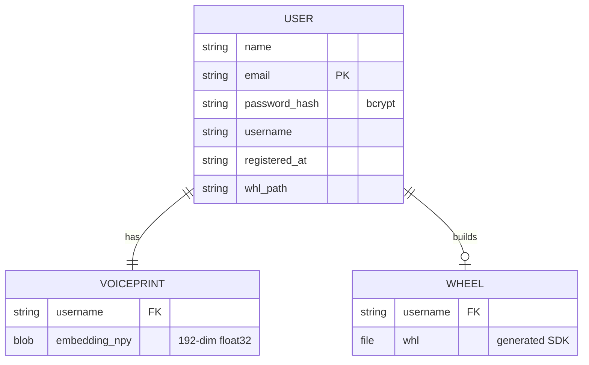

| Column | Type | Notes |
|--------|------|-------|
| `name` | string | Display name |
| `email` | string | Primary key / login identity |
| `password_hash` | string | bcrypt hash (never plaintext) |
| `username` | string | Slugified folder name |
| `registered_at` | string | UTC timestamp |
| `whl_path` | string | Path to the built SDK |

---

## 📁 Project structure

```
Voice-Authentication-System/
├── Backend/
│   ├── app/
│   │   ├── main.py            # FastAPI routes
│   │   ├── config.py          # env-driven settings
│   │   ├── security.py        # bcrypt + JWT
│   │   ├── database.py        # CSV user store (hashed)
│   │   ├── email_service.py   # optional welcome email
│   │   ├── rate_limit.py      # auth brute-force guard
│   │   └── pipeline/          # preprocess → embed → average → inject → build
│   ├── template/              # the SDK skeleton baked per-user
│   ├── tests/                 # pytest suite (17 tests)
│   └── requirements.txt
├── Frontend/                  # static multi-page UI (7 pages)
├── Docs/Screenshots/          # README imagery
├── .github/workflows/ci.yml   # lint + test on every push
├── Dockerfile
├── docker-compose.yml
├── .env.example
└── LICENSE
```

---

## 🧪 Testing & quality

```bash
pip install -r Backend/requirements-dev.txt
pytest                 # 17 unit + API tests (pipeline mocked, no models needed)
ruff check backend     # lint
ruff format backend    # format
```

CI runs all three on every push and pull request via GitHub Actions.

**✅ Verified end-to-end:** the full generation pipeline has been run with the real
libraries — audio preprocessing → voiceprint injection → **`.whl` compilation** →
installing and importing the generated `audioauth` SDK (`authenticate()` present, 192-dim
`MASTER_EMBEDDING` baked in) — for both the individual and company build paths.

---

## 🔐 Security

- **Passwords hashed with bcrypt** (work factor 12) — never stored in plaintext.
- **JWT bearer authentication** on every sensitive endpoint; the acting user is resolved
  from the signed token, not from client-supplied fields.
- **CORS** restricted to an explicit env-driven allow-list.
- **Per-file upload size caps** and strict extension checks.
- **Rate-limited** auth endpoints to blunt brute-force attempts.
- **Secrets** read from the environment, never hard-coded.

See [SECURITY.md](SECURITY.md) for the hardening checklist and disclosure policy.

---

## 🗺️ Roadmap

- [ ] Swap the CSV store for SQLite/PostgreSQL
- [ ] Liveness / anti-spoofing detection
- [ ] Refresh-token rotation
- [ ] Multi-language SDK targets (JS/Rust bindings)
- [ ] Admin dashboard for enrolled profiles

---

## 🏷️ Keywords

`voice-authentication` · `speaker-recognition` · `speaker-verification` · `ecapa-tdnn` ·
`speechbrain` · `voice-biometrics` · `biometrics` · `audio-processing` · `audio-classification` ·
`deep-learning` · `machine-learning` · `pytorch` · `fastapi` · `python` · `jwt` · `bcrypt` ·
`rest-api` · `docker` · `github-actions` · `pytest` · `tailwindcss` · `three-js` · `webgl` ·
`voice-embeddings` · `cosine-similarity` · `on-device-ai` · `privacy-first`

---

## 📚 More docs

- [CHANGELOG.md](CHANGELOG.md) — version history (v1 → v2)
- [CONTRIBUTING.md](CONTRIBUTING.md) — how to contribute
- [SECURITY.md](SECURITY.md) — security policy & hardening checklist
- [PUBLISHING.md](PUBLISHING.md) — step-by-step GitHub publishing guide

---

## 📝 License & author

Released under the [MIT License](LICENSE) © 2026 **Asadullah Irshad**.

<div align="center">

**⭐ If you find this project useful, please consider giving it a star!**

Made with ❤️ and Python

</div>
